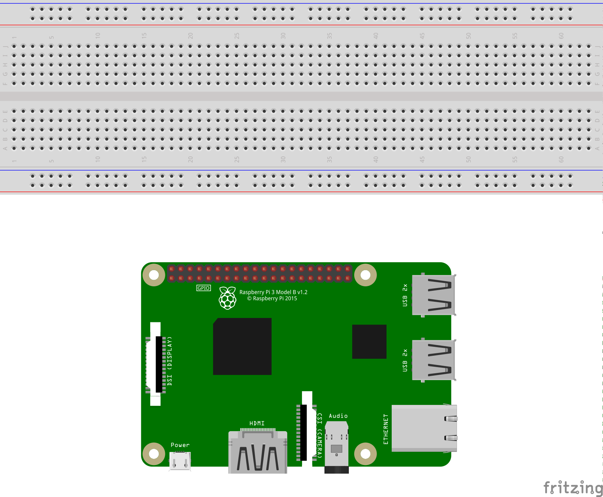

# Example 0: Hello World

## Objective

Get familiar with writing python code on Raspberry Pi (RPi).

## Hardware Setup



## Software (`code.py`)

``` python
print("Hello World")
```

## Output

``` bash
$ python code.py
Hello World
```

## Exploration

* Edit the code to print "Hello World" in a different color.
* Edit the code to simulate someone typing "Hello World" (reveal each letter at a time on the same line).
