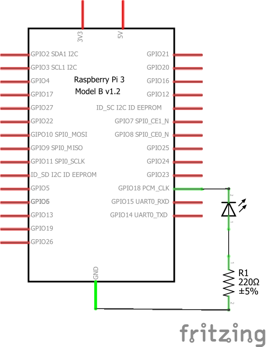
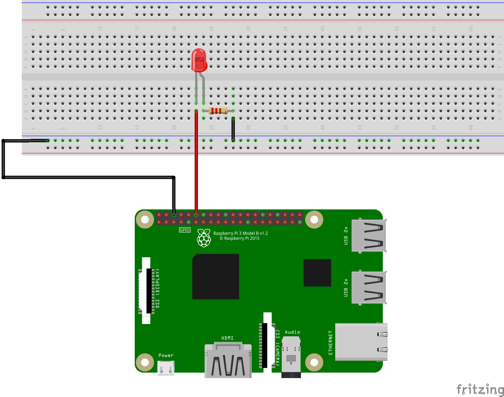

# Example 1: Light an LED

## Objective

Get familiar with wiring up an LED on the breadboard and controlling the GPIO ports with python (`RPi.GPIO`).

## Circuit Diagram



## Hardware Setup



## Software (`code.py`)

``` python
# Import the RPi.GPIO library and refer to it as GPIO
import RPi.GPIO as GPIO
import time

# Use the BOARD mode for pin numbering
GPIO.setmode(GPIO.BOARD)

# Select pin 12 as your LED pin
LED = 12

# Set the LED port as output and assign it an initial value
GPIO.setup(LED, GPIO.OUT)

try:

  while True:
    # Keep running the following until CTRL-C pressed
    GPIO.output(LED, 1)
    print("LED ON")
    time.sleep(0.5)
    GPIO.output(LED, 0)
    print("LED OFF")
    time.sleep(0.5)

except KeyboardInterrupt:
  print("Bye bye")

# Clean up on exit
GPIO.cleanup()
```

## Output

``` bash
$ python code.py
LED ON
LED OFF
LED ON
LED OFF
^CBye bye
```

## Exploration

* Edit the frequency at which the LED is blinking. What is the maximum frequency at which the human eye can still see it blinking?
* Edit the LED blinking sequence to have the LED blink an S-O-S signal in morse code.
