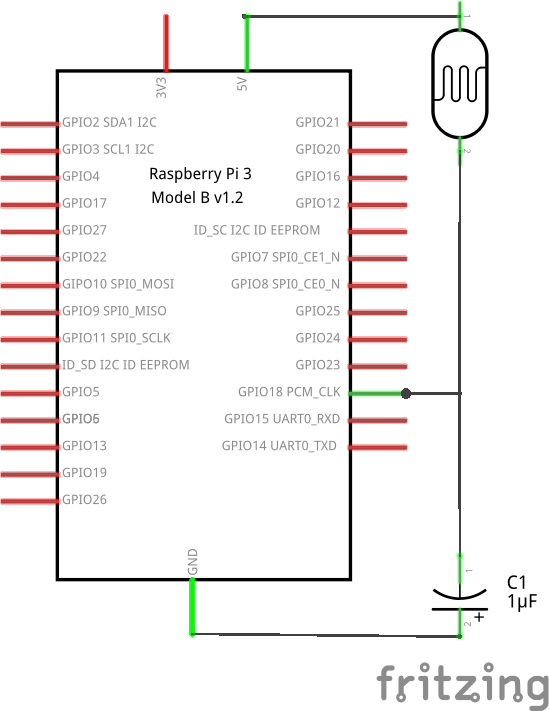
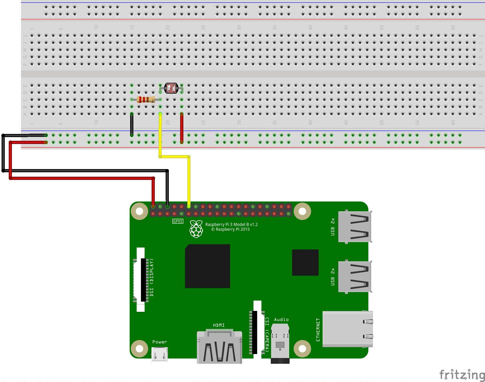

# Example 2: Read Light Sensor

## Objective

Read the voltage from a light sensor and report the value.

## Circuit Diagram



## Hardware Setup



## Software (`code.py`)

``` python
# Import the LightSensor module from the gpiozero library
from gpiozero import LightSensor

# Select pin 12 as your LIGHT pin
LIGHT = LightSensor(18)

try:

  while True:
    # Keep running the following until CTRL-C pressed
    print(LIGHT.value)

except KeyboardInterrupt:
  print("Bye bye")
```

## Output

``` bash
$ python code.py
```

Report the numbers that you see, what do they mean?

## Exploration

* The value gets larger when the sensor gets more light. Change the circuit to cause the value to become smaller as the sensor gets more light.
