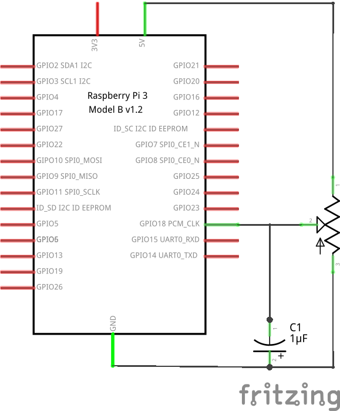

# Example 3: Read a Potentiometer

## Objective

Read the voltage from a potentiometer and report the value.


## Circuit Diagram



## Hardware Setup


## Software (`code.py`)

``` python
# Import the LightSensor module from the gpiozero library
from gpiozero import LightSensor

# Select pin 12 as your POTENTIOMETER pin
POTENTIOMETER = LightSensor(18)

try:

  while True:
    # Keep running the following until CTRL-C pressed
    print(POTENTIOMETER.value)

except KeyboardInterrupt:
  print("Bye bye")
```

## Output

``` bash
$ python code.py
```

Now turn the know of the potentiometer. Report the numbers that you see, how do they differ from the light sensor of the previous example?

## Exploration

* Print a message when the value of the sensor input is greater than a threshold.
