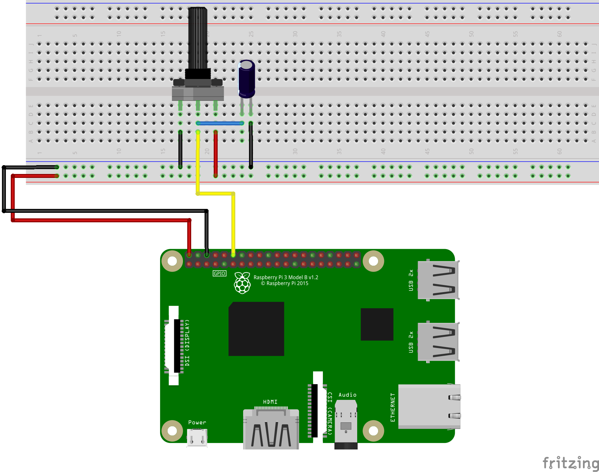

# Example 3: Read a Potentiometer

## Objective

Read the voltage from a potentiometer and report the value.


## Circuit Diagram


## Hardware Setup



## Software (`code.py`)

``` python
# Import the RPi.GPIO library and refer to it as GPIO
import RPi.GPIO as GPIO

# Use the BOARD mode for pin numbering
GPIO.setmode(GPIO.BOARD)

# Select pin 12 as your POTENTIOMETER pin
POTENTIOMETER = 12

# Set the LIGHT port as input
GPIO.setup(POTENTIOMETER, GPIO.IN)

try:

  while True:
    # Keep running the following until CTRL-C pressed
    value = GPIO.input(POTENTIOMETER)
    print(value)

except KeyboardInterrupt:
  print("Bye bye")

# Clean up on exit
GPIO.cleanup()
```

## Output

``` bash
$ python code.py
240
248
250
256
262
264
591
591
591
591
```

## Exploration

* Print a message when the value of the sensor input is greater than a threshold.
