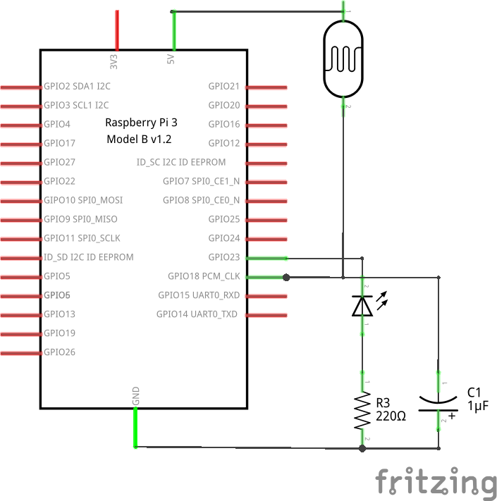
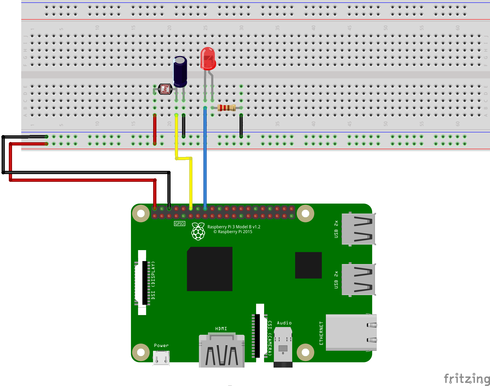

# Example 4: Build a Nightlight

## Objective

Create a nightlight by linking the value of the light sensor to the LED output. Determine a threshold for the light sensor and enable the LED when the room is dark; and disable the LED when the room has adequate light. Additionally, print the word "DAY" on the terminal one time on the transition to day and the word "NIGHT" one time on the transition to night.

In this example, the provided code is just a skeleton for the final solution. This will provide you with an opportunity to create a custom solution.
Read the voltage from a potentiometer and report the value.

## Circuit Diagram



## Hardware Setup



## Software (`code.py`)

``` python
from gpiozero import LED, LightSensor

LIGHT = LightSensor(16)
LED = LED(12)

try:

	while True:
		# Keep running the following until CTRL-C pressed
		# TODO: Add your code to create a night light here
		pass

except KeyboardInterrupt:
	print("Bye bye")
```

## Output

``` bash
$ python code.py
DAY
NIGHT
DAY
NIGHT
DAY
NIGHT
DAY
```
