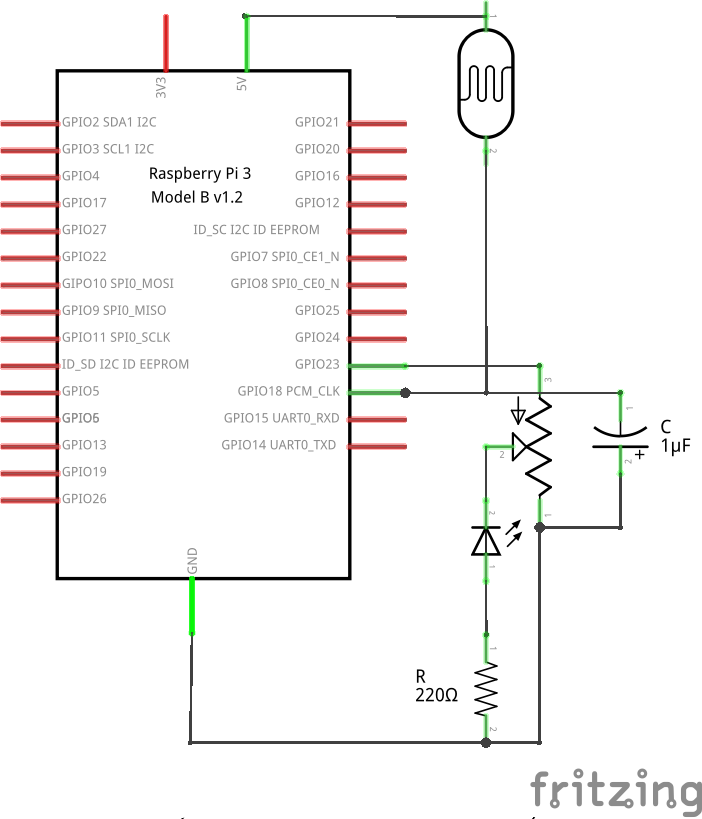
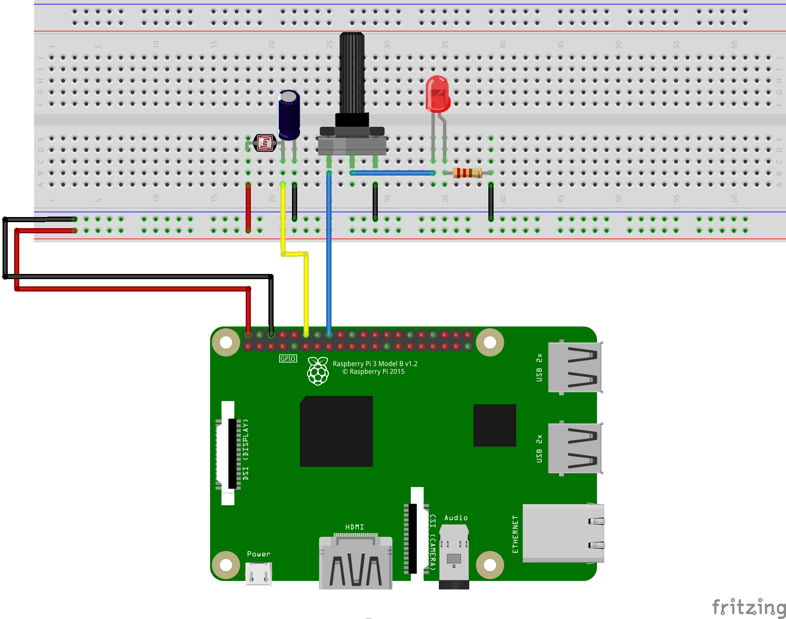

# Example 5: Dim the Nightlight

## Objective

This example builds on top of the previous one. Add a potentiometer into the circuit to change the LED brightness of the nightlight. This does not change the code nor the output on the terminal.

## Circuit Diagram

## Hardware Setup

