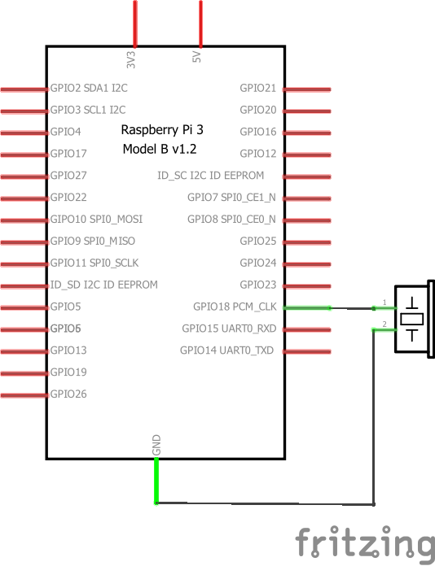
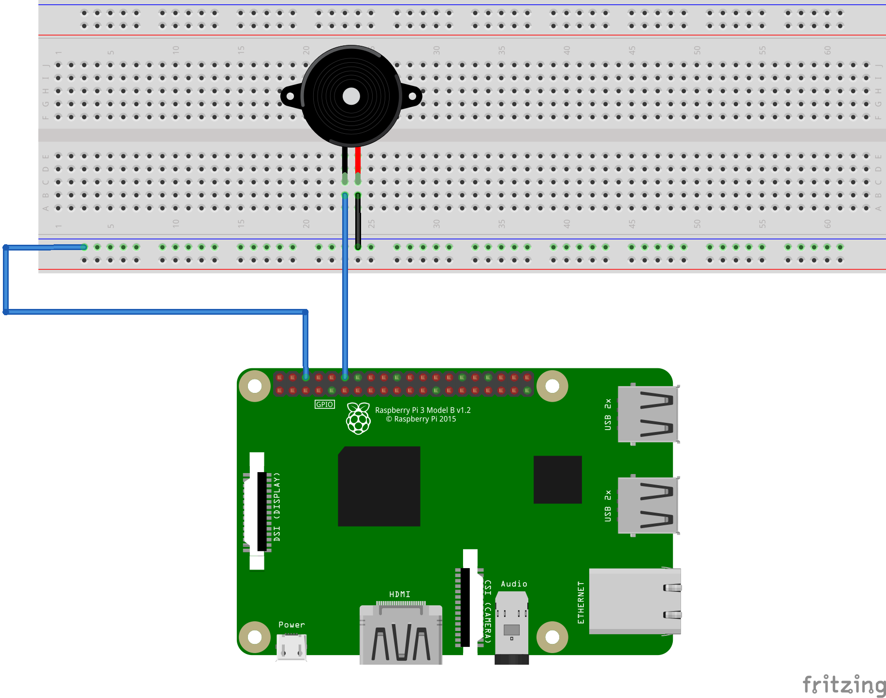

# Example 6: Make noise with a buzzer

## Objective

Get familiar with generating sound waves for the buzzer.

## Circuit Diagram



## Hardware Setup



## Software (`code.py`)

Reuse the code from Example 1: Light an LED and observe what happens. What do you hear?

Now run the following code:

``` python
import RPi.GPIO as GPIO
import time


BUZZ = 12

GPIO.setmode(GPIO.BOARD)
GPIO.setup(BUZZ, GPIO.OUT)

try:

  for i in range(50, 2000, 50):
    print(str(i) + " " + 1/i)
    for j in range(0, i/5):
      GPIO.output(BUZZ, 0)
      time.sleep(2.0/i)
      GPIO.output(BUZZ, 1)
      time.sleep(2.0/i)

except KeyboardInterrupt:
  print("Bye bye")

# Clean up on exit
GPIO.cleanup()
```

## Output

``` bash
$ python code.py
50 0.02
100 0.01
150 0.00666666666667
200 0.005
250 0.004
300 0.00333333333333
350 0.00285714285714
400 0.0025
450 0.00222222222222
500 0.002
```

What do you hear and what do these numbers mean?
